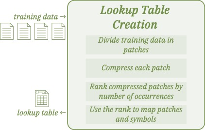
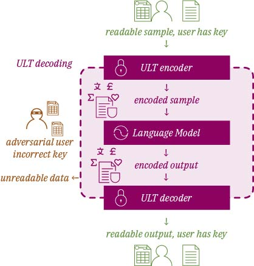

# Unified Lookup Tables

Transformers, despite their success in a variety of sequence modeling tasks, have a significant limitation: they are inherently data-greedy, which can lead to overfitting when the data are scarce.
In such cases, common practice is to build a foundation model, a model trained on large amounts of publicly available data, that can then be fine tuned for a specific task. Another known problem of foundation models is training data leakage.
It has been demonstrated that excerpts of the training data can be obtained by prompt engineering on a foundation model, which poses a high risk of exposing confidential data.
This repository implements Unified Lookup Tables (ULT), a data preprocessing step for building and fine tuning foundation models in a data-agnostic manner, which simultaneously enables the reuse of a trained model on new datasets without exposing any training data.
The method relies on data compression methods as efficient modality tokenizers, and a common representation vocabulary for all datasets.

 


## Installation of dependencies
The repository contains a python package that implements ULT, dependencies are managed with `poetry`:

```console
poetry install
```


## Usage for data preprocessing
See examples of ULT data processing for text and images in `notebooks/`.


## Usage for training
To pretrain `SmolLM-135M` on the `wikitext` dataset using our ULT run the following script where the file `train_args.yaml` contains training arguments that can be modified as desired.
```console
poetry run scripts/python training_ult.py --dataset_name wikitext --train_args_path train_args.yaml
```

To pretrain on the `PASS` images dataset
```console
poetry run scripts/python training_ult.py --dataset_name pass --train_args_path train_args.yaml
```

To finetune the image pretraining to the `CIFAR10` dataset run the same script as above but replace loading the `SmolLM-135M` from scratch dataset for the checkpoint obtained from PASS pretraining.


## Structure of the code

- `scripts` contains the basic training pipelines leveraging the package
- `ult.data` contains data loaders for the three datasets from the paper "Unified Lookup Tables: Privacy Preserving Foundation Models"
- `ult.transforms` and `ult.configuration` contain the code for encoding and decoding the data, as well as building a lookup table.
- `tests` contains unit tests

**NOTE**: for running tests follow this procedure

```console
poetry run pip install pytest
poetry run pytest -sv tests
```
